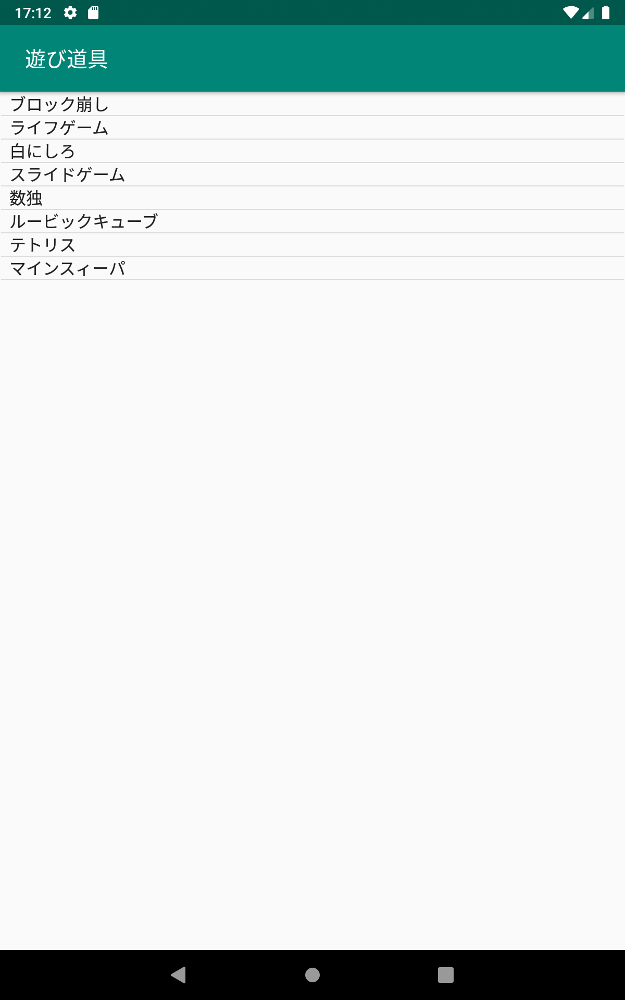
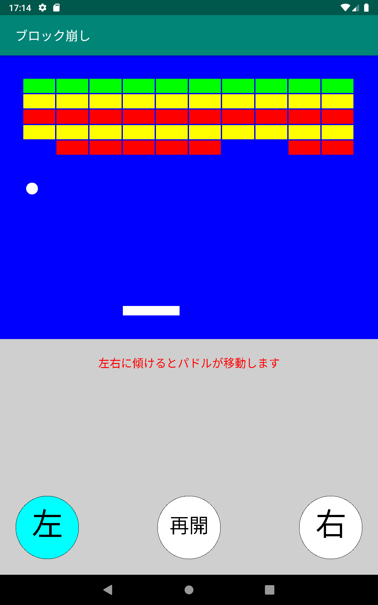
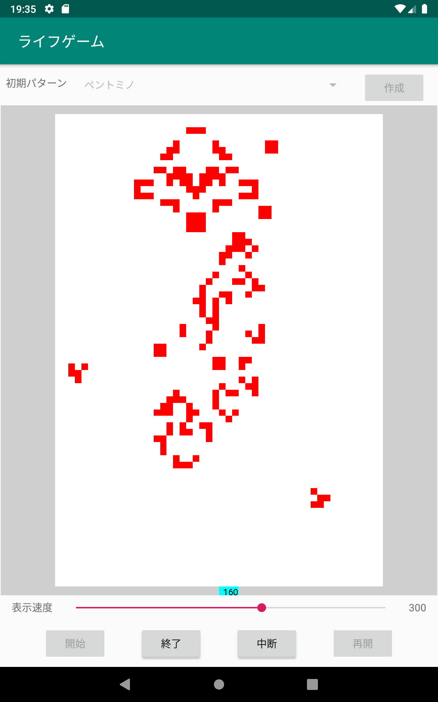
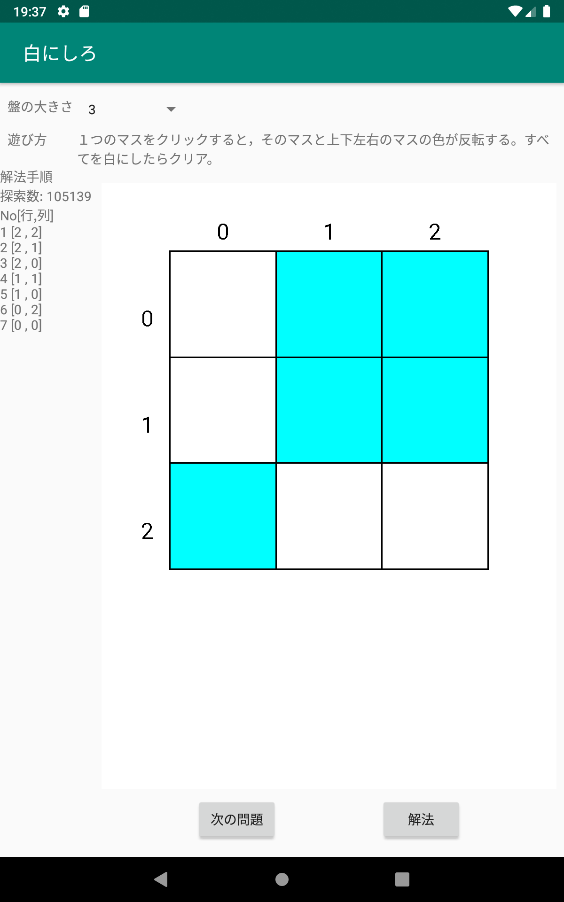
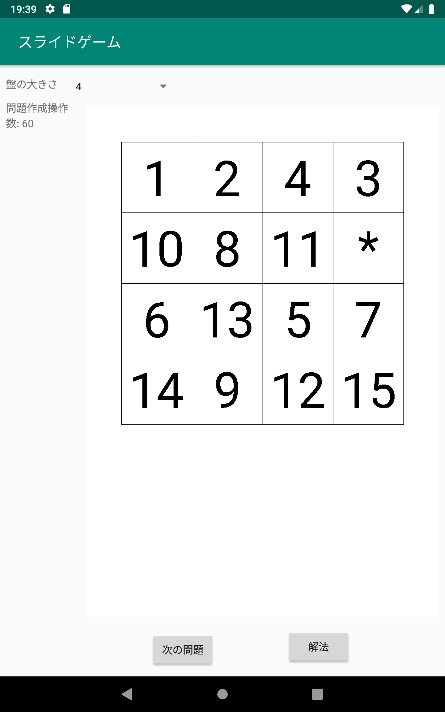
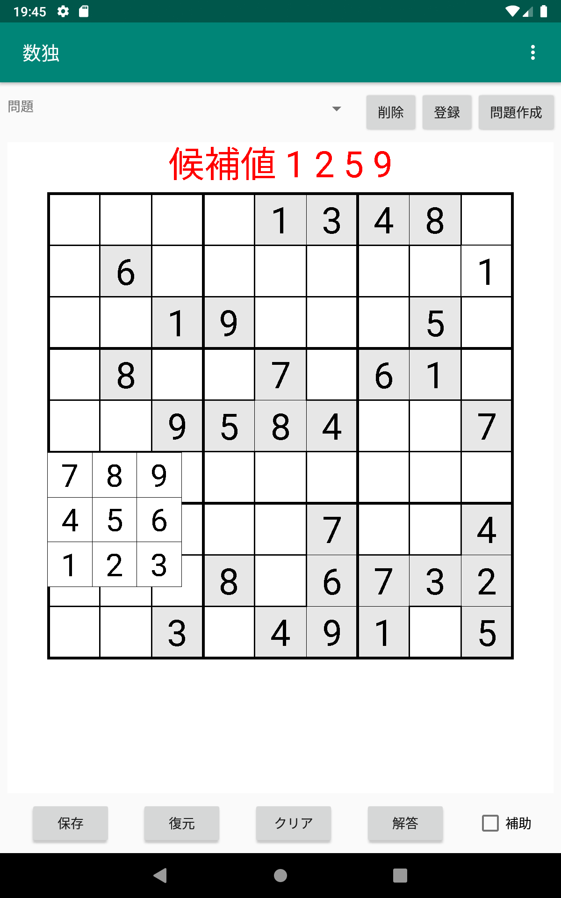
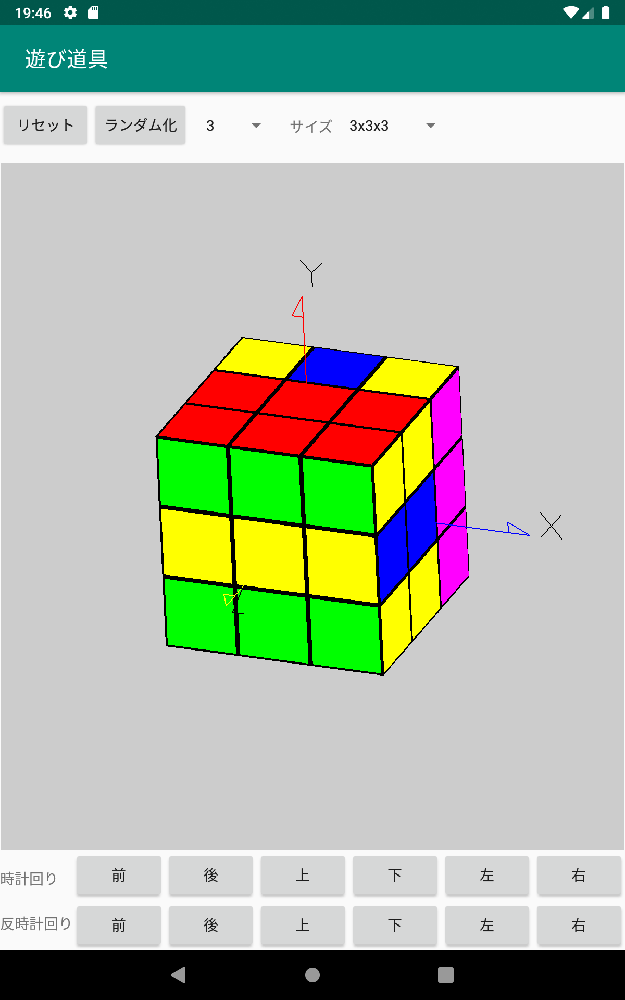
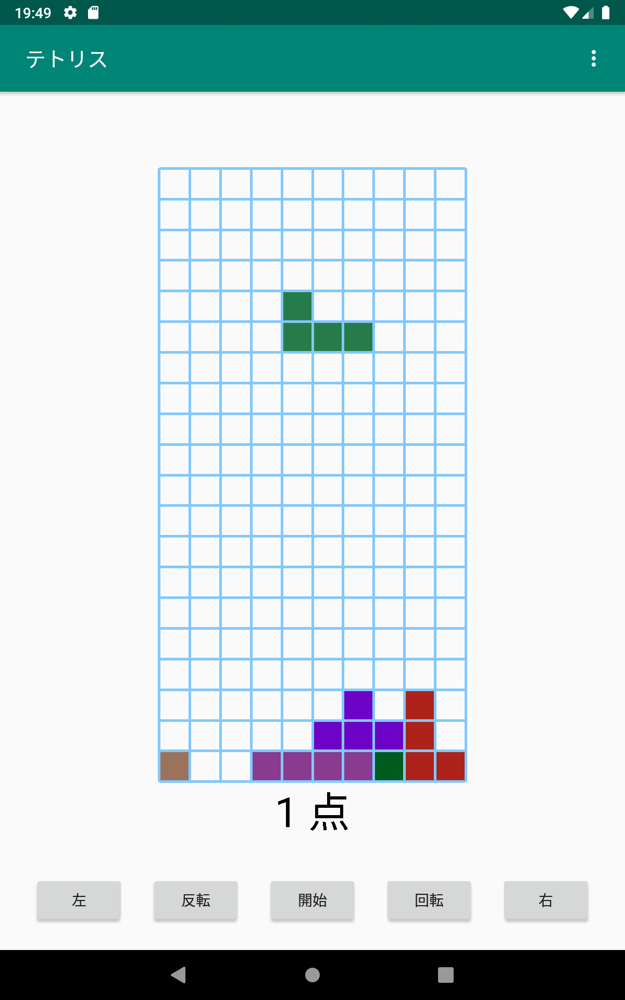
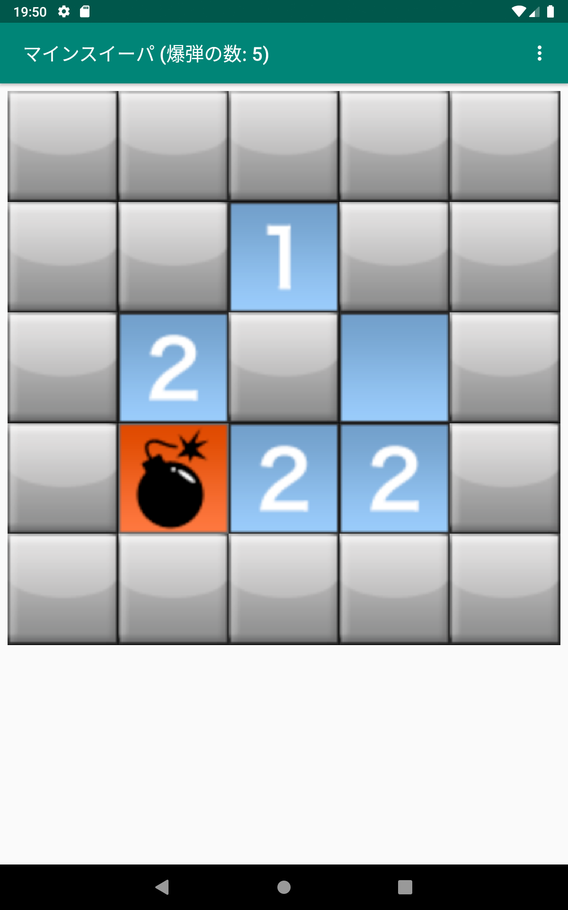

# **遊び道具(GameApp)**

シンプルなゲームの寄せ集めのアプリケーション  

**インストール方法**  
1) GameApp-debug.apk をダウンロードする  
2) 設定で「セキュリティとプライバシー」で(「特別なアプリアクセス」の)「提供元が不明なアプリをインストール」で「許可」またはインストールに使用するアプリで「許可」にする。(これはアンドロイドのバージョンや機種によって異なる)  
3) イントール機能を持ったファイル管理ソフトでダウンロードしたapkファイルをタッチしてインストールする。 
4) ファイル管理ソフトは機種によって異なるのが例えば「Files by Google」などがインストール機能を持っている。「共有」でインストールメニューが出ても使えないソフトもあるので注意。 
5) インストールした後は「設定」の「アプリと通知」で「遊び道具」を選択し権限の「ストレージ」を ON にする

**起動画面**  
  

**ブロック崩し**  
  

**ライフゲーム**  
  

**白にしろ**  
  

**スライドゲーム(15ゲーム)**  
  

**数独**  
  

**ルービックキューブ**  
  

**テトリス**  
  

**マインスイーパー**  
  

