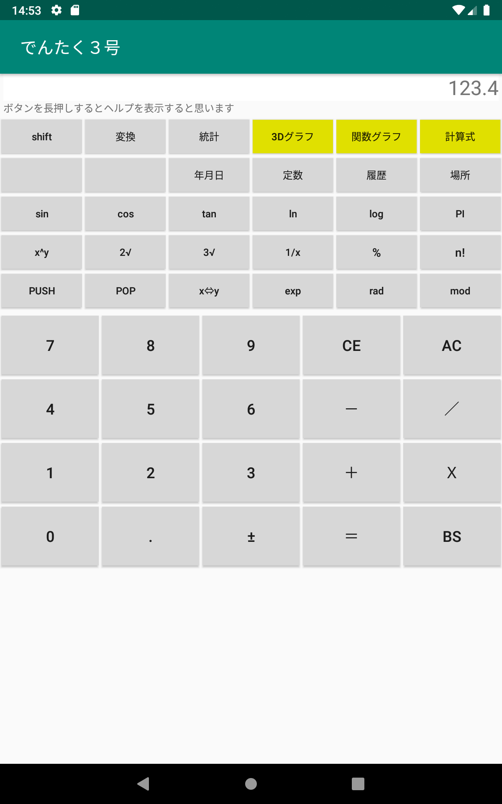
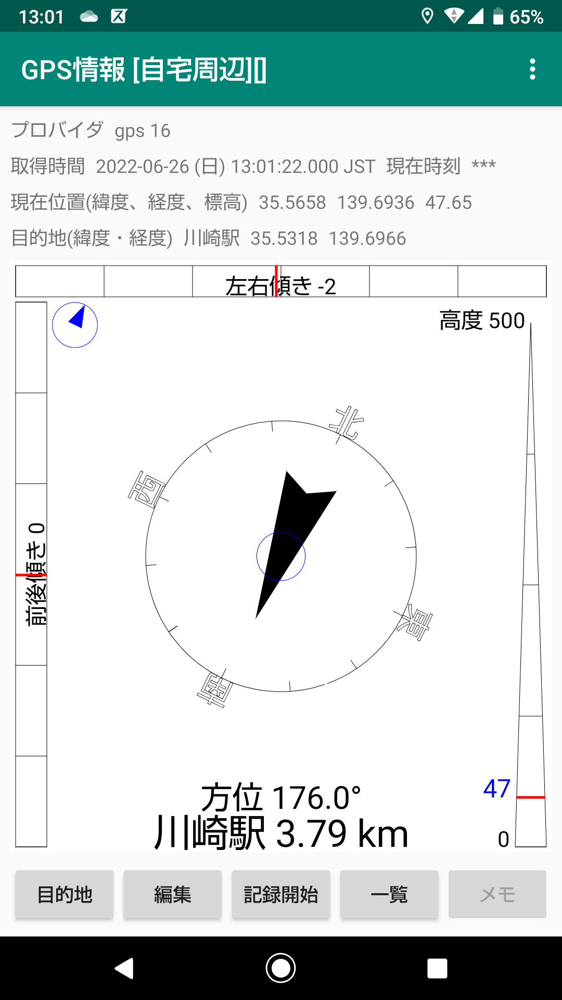
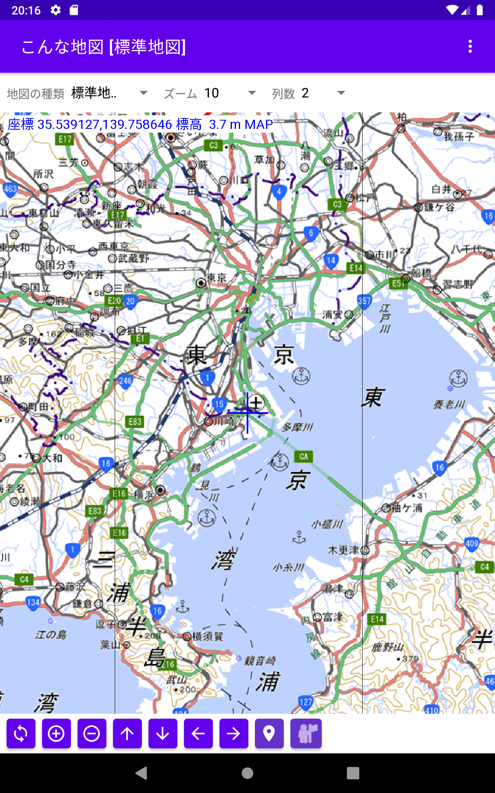
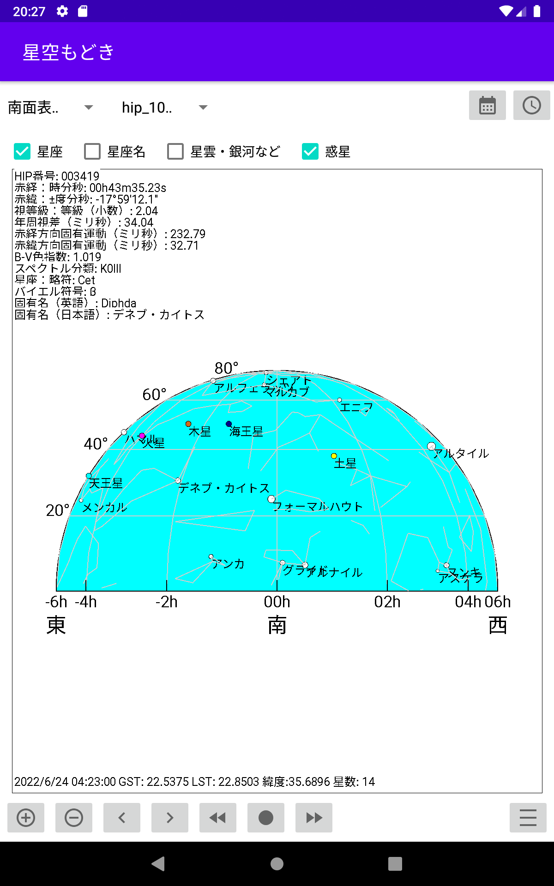
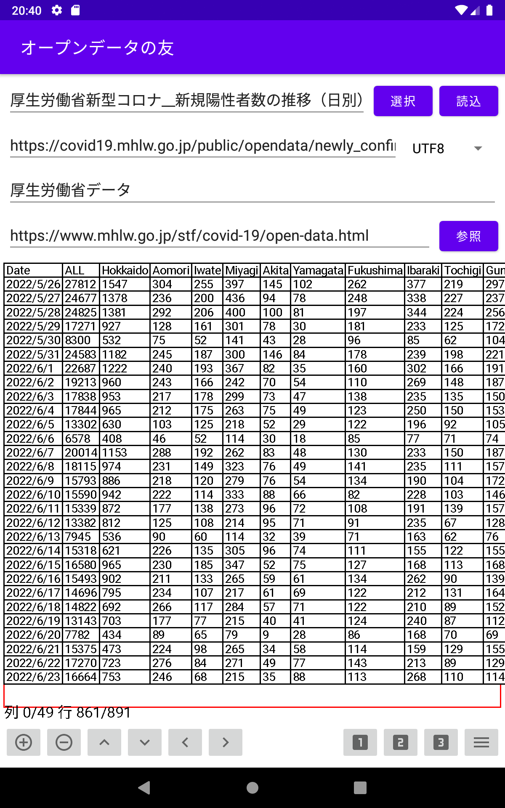
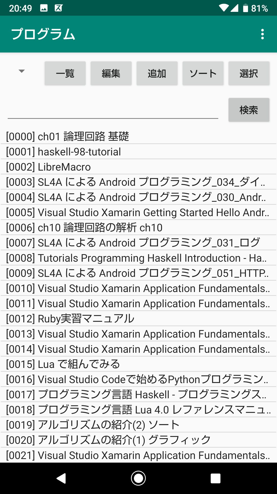
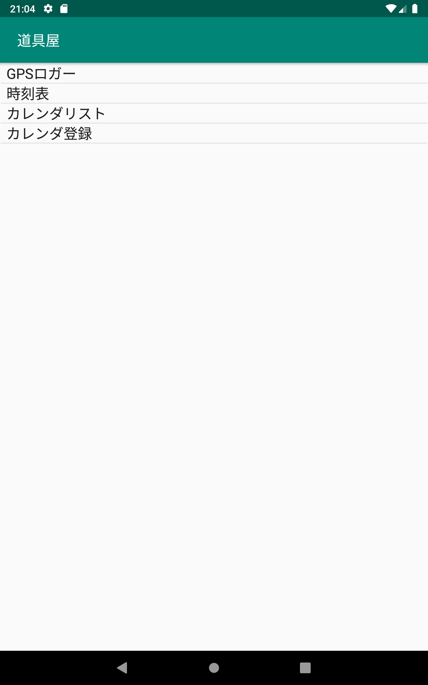

# Android用アプリケーションソフト  

## **電卓3号(calc2)**  
電卓アプリ  
・普通の電卓アプリに計算式、関数グラフ、3Dグラフ機能を持つ  
  

## **遊び道具(GameApp)**  
シンプルなゲームの寄せ集め
・ブロック崩し、ライフゲーム、白にしろ、スライドゲーム、数独、ルービックキューブ、テトリス、マインスーパ  
  

## **あっちです(gpsinfo2)**  
目的地の方位や距離の確認とGPSトレース機能  
  

## **こんな地図(mapapp)**  
国土地理院のいろいろな地図を表示、GPSトレース、Wikipediaのデータが利用できる地図ソフト  
  

## **星空もどき(planetapp)**  
恒星や星座、惑星をシンプルに表示するソフト  
  

## **オープンデータの友(tablegrah)**  
Web上のオープンデータを表やグラフ表示する  
  

## **ドキュメント管理(ymemo)**  
ドキュメントファイルを管理する()  
  

## **道具箱(ytoolapp)**  
チョットしたアプリ  
  

67