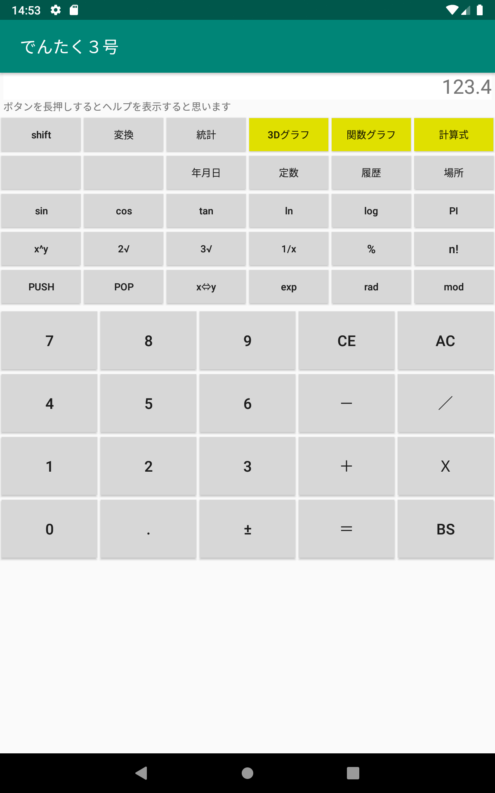

# **でんたく3号(calc2)**

いろいろな機能を持った電卓アプリケーション  

**インストール方法**  
1) calc2-debug.apk をダウンロードする  
2) 設定で「セキュリティとプライバシー」で(「特別なアプリアクセス」の)「提供元が不明なアプリをインストール」で「許可」またはインストールに使用するアプリで「許可」にする。(これはアンドロイドのバージョンや機種によって異なる)  
3) イントール機能を持ったファイル管理ソフトでダウンロードしたapkファイルをタッチしてインストールする。 
4) ファイル管理ソフトは機種によって異なるのが例えば「Files by Google」などがインストール機能を持っている。「共有」でインストールメニューが出ても使えないソフトもあるので注意。 
5) インストールした後は「設定」の「アプリと通知」で「でんたく3号」を選択し権限の「ストレージ」を ON にする

**起動画面(普通の電卓)**  
  

**普通の電卓のShift画面**  
  

**統計計算画面**  
  

**統計計算画面**  
  

**統計グラフ**  
  

**数式による計算処理**  
  

**数式による計算処理**  
  

**関数の2次元グラフ表示**  
  

**関数の2次元グラフ表示**  
  

**関数の三次元表示**  
  

**関数の3次元表示**  
  
