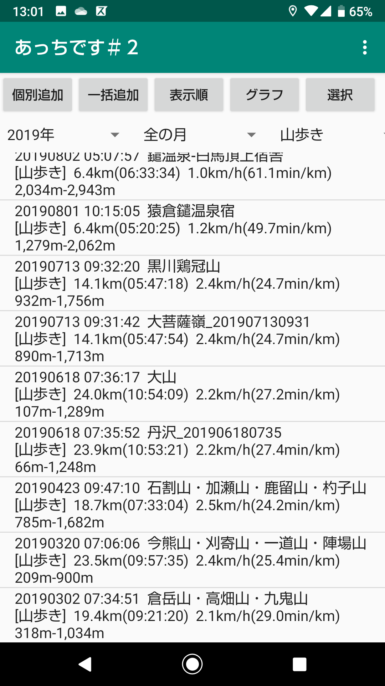
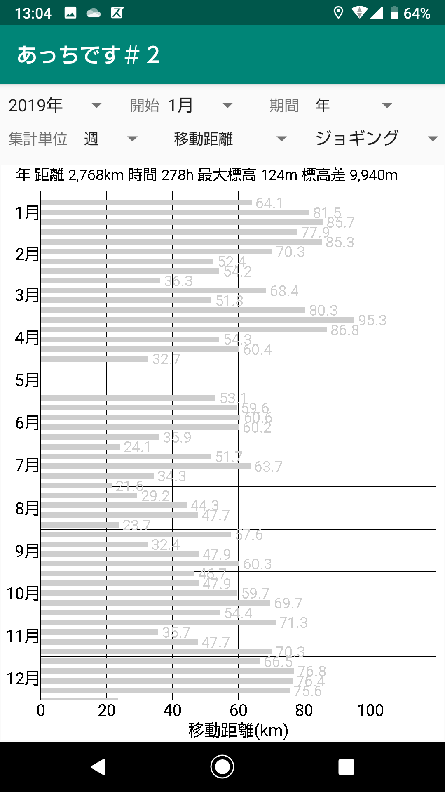
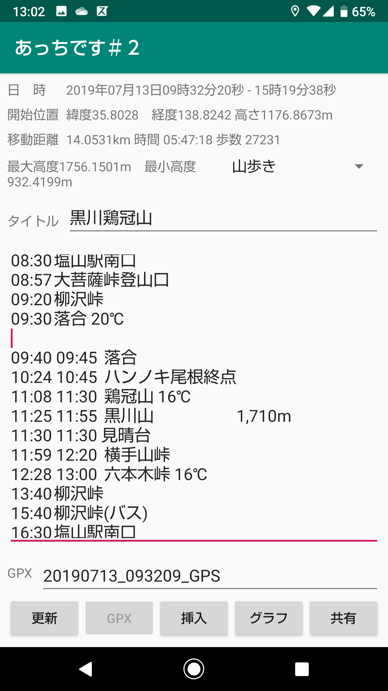
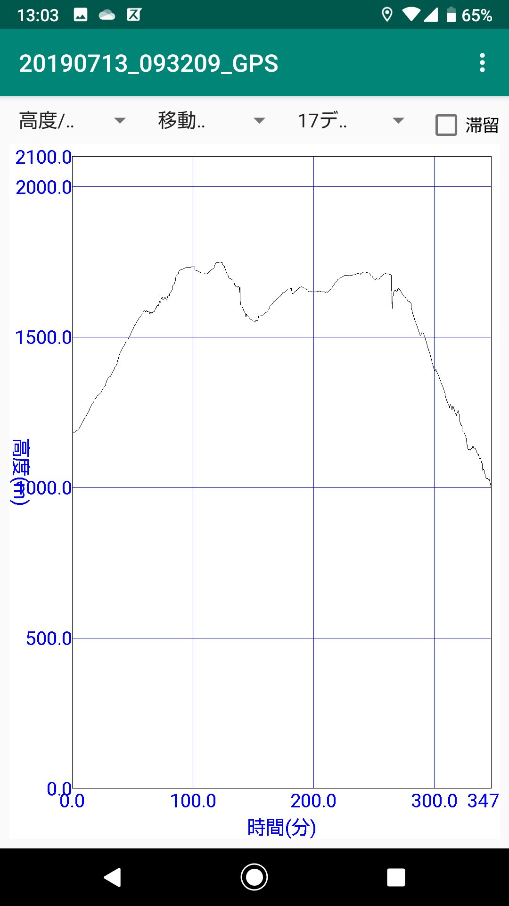

# **あっちです(gpsinfo2)**

GPS機能を使って目的地の方向や距離、GPSのトレースデータを管理するアプリケーション  

**インストール方法**  
1) gpsinfo2-debug.apk をダウンロードする  
2) 設定で「セキュリティとプライバシー」で(「特別なアプリアクセス」の)「提供元が不明なアプリをインストール」で「許可」またはインストールに使用するアプリで「許可」にする。(これはアンドロイドのバージョンや機種によって異なる)  
3) イントール機能を持ったファイル管理ソフトでダウンロードしたapkファイルをタッチしてインストールする。 
4) ファイル管理ソフトは機種によって異なるのが例えば「Files by Google」などがインストール機能を持っている。「共有」でインストールメニューが出ても使えないソフトもあるので注意。 
5) インストールした後は「設定」の「アプリと通知」で「あっちです」を選択し権限の「ストレージ」と「位置情報」を ON にする

**起動画面**  
  

**GPSトレースリスト**  
  

**GPSトレースリストのグラフ化**  
  

**GPSトレースデータの編集画面**  
  

**GPSトレースデータのグラフ化**  
  

