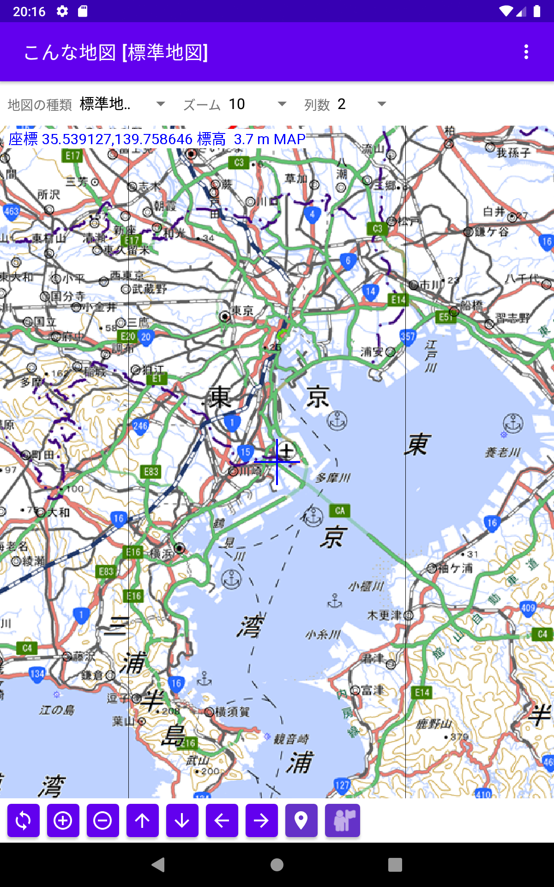
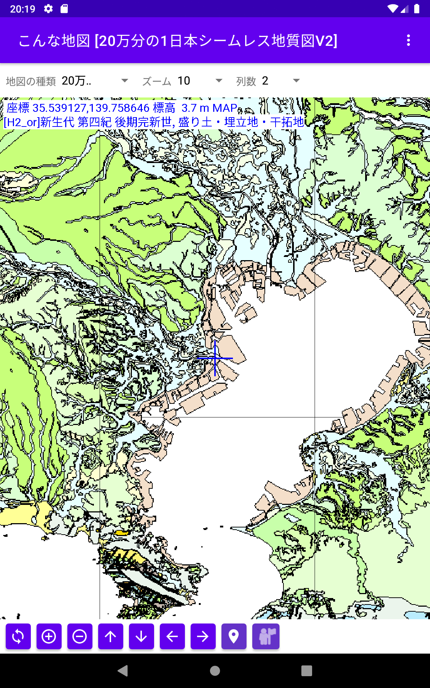
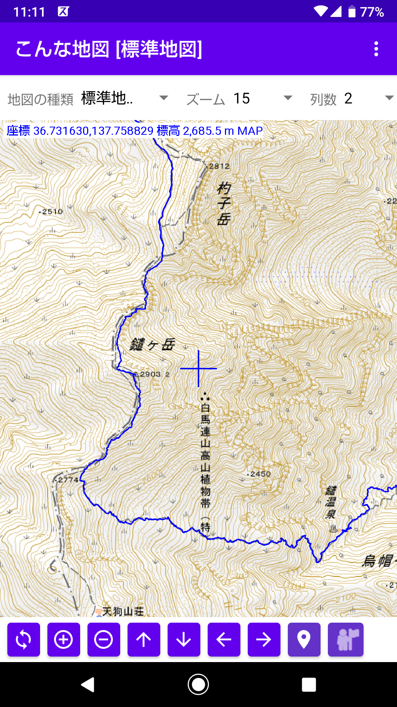
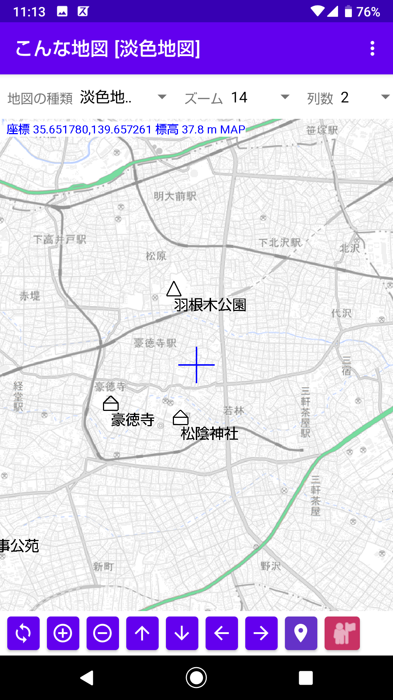
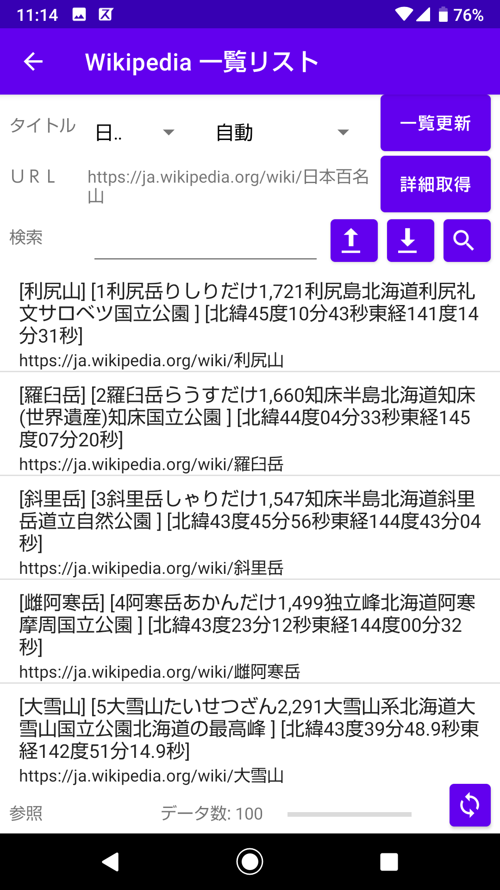
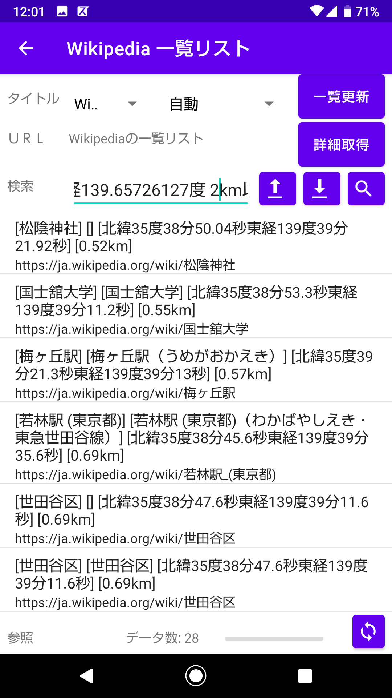

# **こんな地図(mapapp)**

国土地理院のいろいろな地図を表示、GPSトレース、Wikipediaのデータが利用できる地図アプリケーション  

**インストール方法**  
1) mapapp-debug.apk をダウンロードする  
2) 設定で「セキュリティとプライバシー」で(「特別なアプリアクセス」の)「提供元が不明なアプリをインストール」で「許可」またはインストールに使用するアプリで「許可」にする。(これはアンドロイドのバージョンや機種によって異なる)  
3) イントール機能を持ったファイル管理ソフトでダウンロードしたapkファイルをタッチしてインストールする。 
4) ファイル管理ソフトは機種によって異なるのが例えば「Files by Google」などがインストール機能を持っている。「共有」でインストールメニューが出ても使えないソフトもあるので注意。 
5) インストールした後は「設定」の「アプリと通知」で「こんな地図」を選択し権限の「ストレージ」と「位置情報」を ON にする

**標準地図**  
  

**日本シームレス地質図**  
  

**GPSトレース**  
  

**地図上のマーク**  
  

**Wikipediaの一覧抽出リスト**  
  

**座標で一覧リストからの検索**  
  

