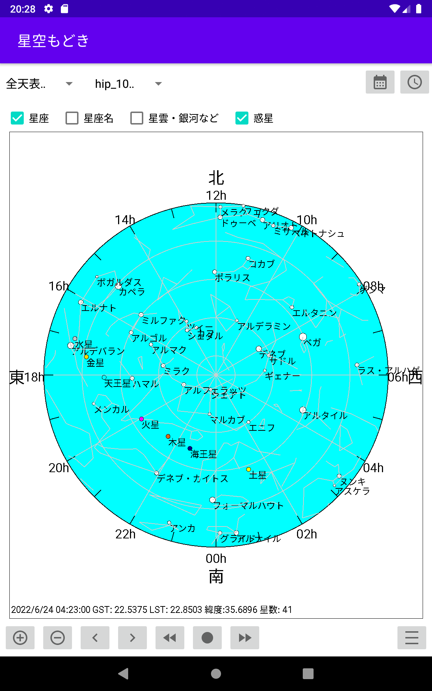
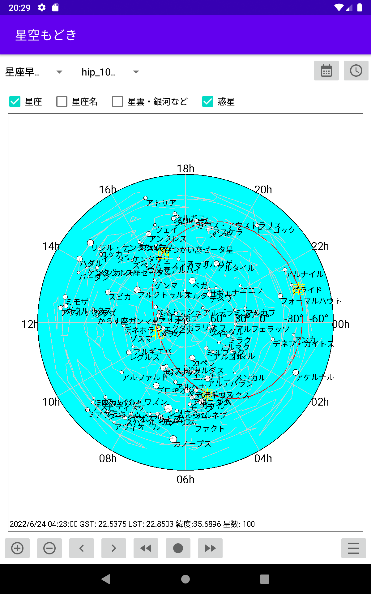
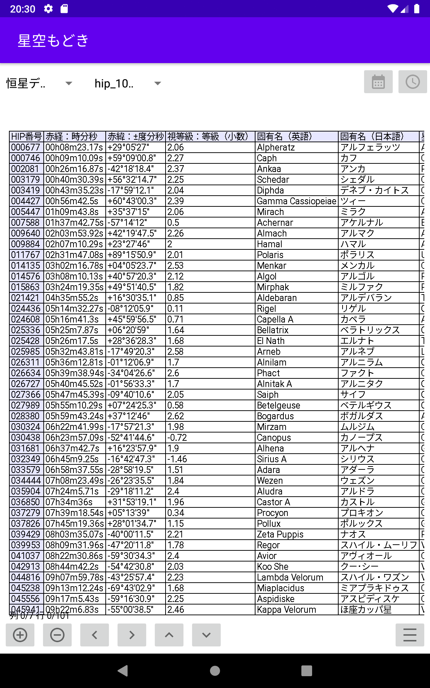
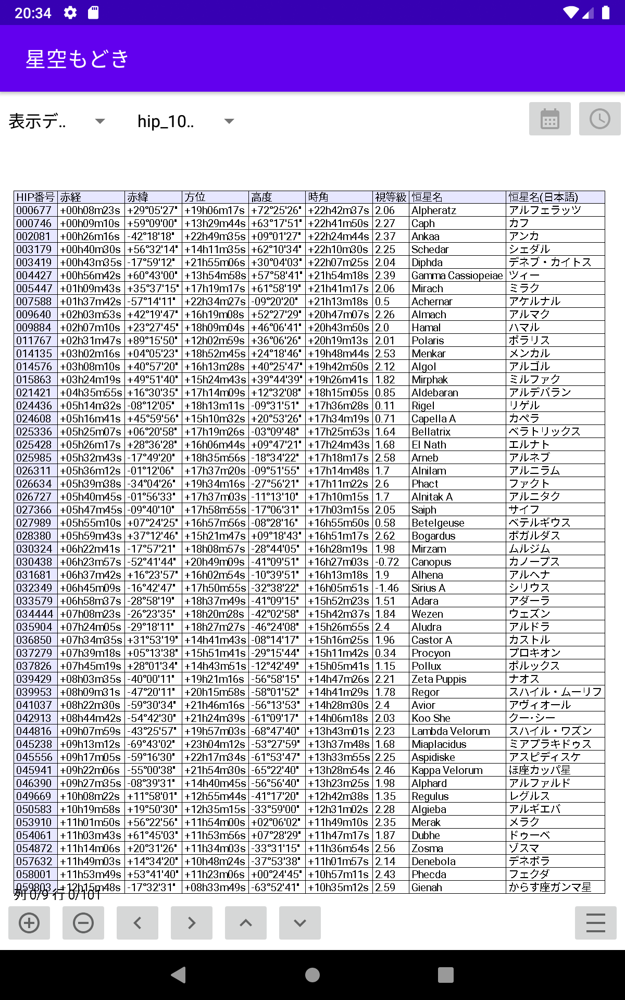
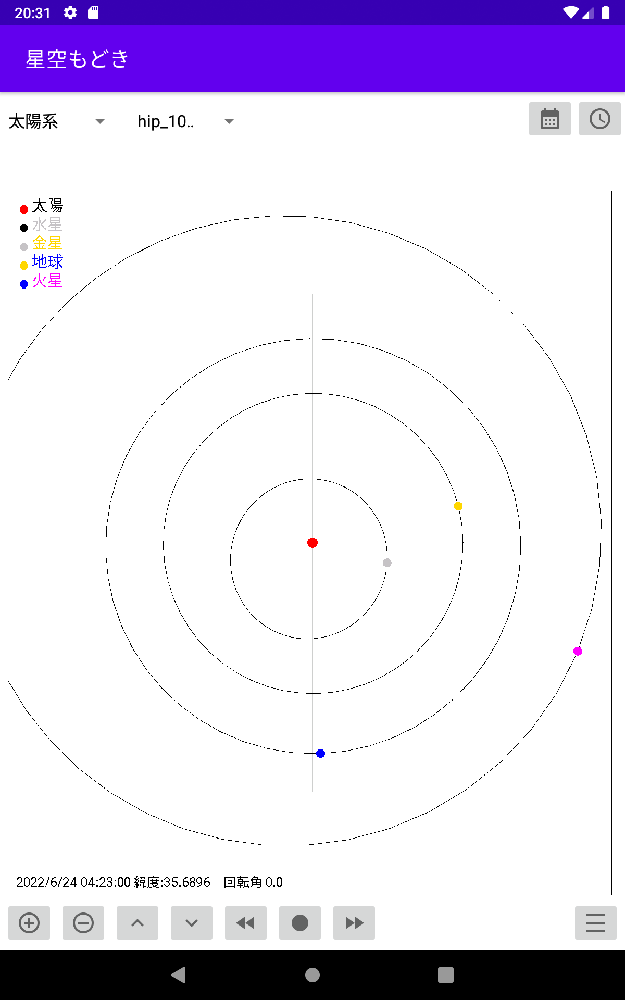
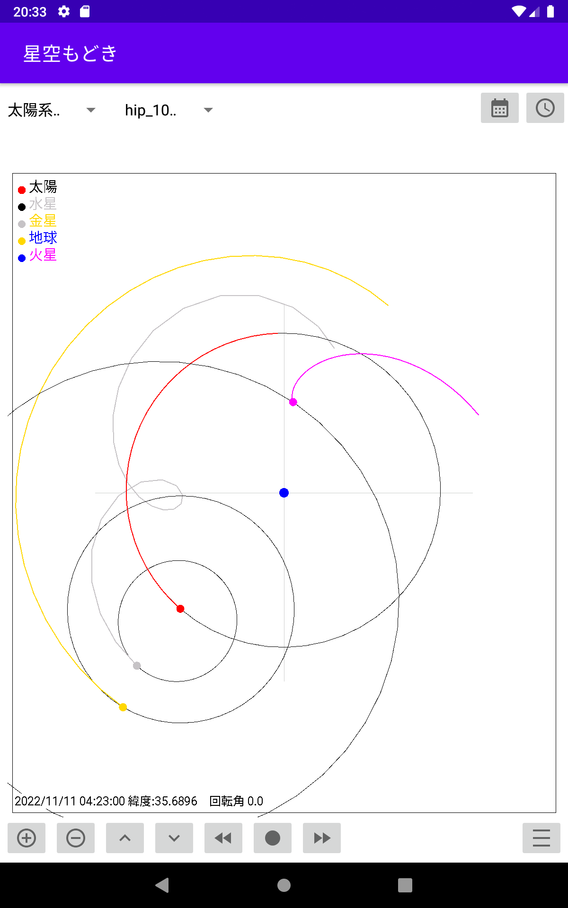

# **星空もどき(planetapp)**

恒星や星座、惑星をシンプルに表示するアプリケーション  

**インストール方法**  
1) 実行ファイル[planetapp-debug.apk](planetapp-debug.apk) をアンドロイド端末にダウンロードする  
2) アンドロイド端末の設定で「セキュリティとプライバシー」で(「特別なアプリアクセス」の)「提供元が不明なアプリをインストール」で「許可」またはインストールに使用するアプリで「許可」にする。(これはアンドロイドのバージョンや機種によって異なる)  
3) イントール機能を持ったファイル管理ソフトでダウンロードしたapkファイルをタッチしてインストールする。 
4) ファイル管理ソフトは機種によって異なるのが例えば「Files by Google」などがインストール機能を持っている。「共有」でインストールメニューが出ても使えないソフトもあるので注意。 
5) インストールした後は「設定」の「アプリと通知」で「星空もどき」を選択し権限の「ストレージ」を ON にする。
6) インストール後は起動が確認出来たら「提供元が不明なアプリをインストール」の設定を元に戻す。

**恒星などデータのコピー**  
1) 実行ファイルをインストールしただけでは星の表示ができないので、[dataフォルダ](data)に入っている恒星や星雲、惑星のデータなどStarDataのフォルダ内のデータも含めてすべてをアンドロイド端末にダウンロードする
2) ダウンロードしたファイルをアンドロイド端末のplanetappフォルダの中にコピーする
3) データをコピー後に「星空もどき」(planetapp)を起動する

**起動画面**  
  

**全天表示**  
  

**星座早見盤のような表示**  
  

**恒星データリスト**  
  

**表示恒星データリスト**  
  

**太陽系の惑星の動き**  
  

**地球を中心とした惑星の動き**  
  
