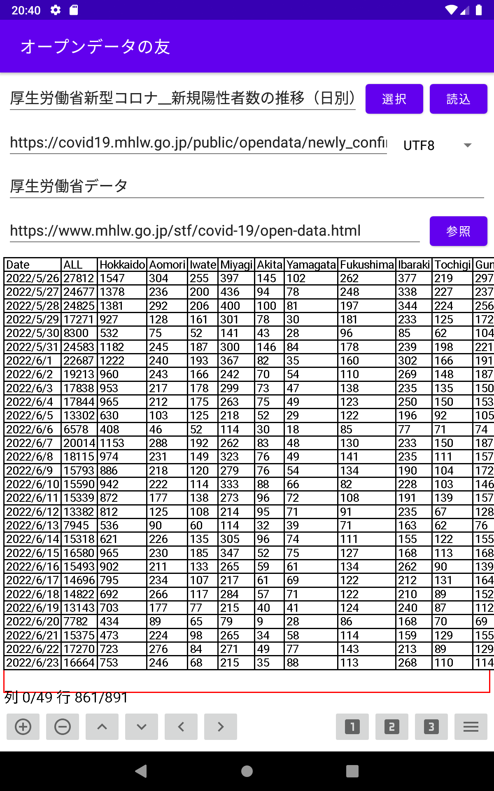

# **オープンデータの友(tablegrah)**

Web上のオープンデータを表やグラフ表示するアプリケーション  

**インストール方法**  
1) tablegraph-debug.apk をダウンロードする  
2) 設定で「セキュリティとプライバシー」で(「特別なアプリアクセス」の)「提供元が不明なアプリをインストール」で「許可」またはインストールに使用するアプリで「許可」にする。(これはアンドロイドのバージョンや機種によって異なる)  
3) イントール機能を持ったファイル管理ソフトでダウンロードしたapkファイルをタッチしてインストールする。 
4) ファイル管理ソフトは機種によって異なるのが例えば「Files by Google」などがインストール機能を持っている。「共有」でインストールメニューが出ても使えないソフトもあるので注意。 
5) インストールした後は「設定」の「アプリと通知」で「オープンデータの友」を選択し権限の「ストレージ」を ON にする

**起動画面**  
  

**データのグラフ表示**  
  
